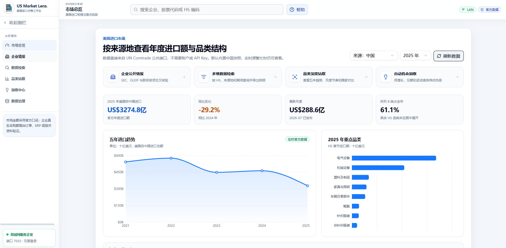
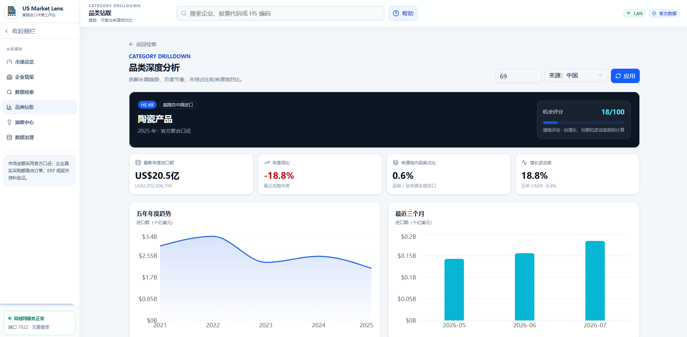

<div align="center">

# US Market Lens · 美国进口市场情报工作台

**用免费公开数据查询美国进口规模、来源国、HS 品类、年度趋势与企业公开情报。**

[](https://www.typescriptlang.org/)
[](https://react.dev/)
[](https://github.com/cloudflare/vinext)
[](https://www.docker.com/)
[](./LICENSE)

🌐 **[在线 Demo · usa.seans.cc.cd](https://usa.seans.cc.cd/)**

**关键词 / Keywords**：美国进口数据 · HS 编码 · 来源国分析 · 供应链情报 · 企业公开信息 · 贸易数据可视化 · US import intelligence · trade partner analysis · procurement intelligence

</div>

---

## 这是什么？

**US Market Lens** 是一个面向外贸业务、市场研究和供应链团队的开源贸易情报工作台。它把 **UN Comtrade、SEC EDGAR、GLEIF、USAspending、World Bank** 等免费公开数据源整合到一个中文界面中，用于分析：

- 美国某个 HS 品类一年进口多少、同比如何变化；
- 主要从哪些国家进口，各来源国金额和占比是多少；
- 品类结构、趋势、集中度和潜在供应链风险；
- 美国公司的法律实体、上市信息、公开财务和联邦业务记录；
- 每条数据来自哪里、更新时间如何、是否需要 API Key。

> **重要口径**：免费公开源能够可靠回答“美国市场从各国进口了多少”，但不能仅凭公司名称完整还原“某家公司实际向谁采购、采购多少钱”。公司级买卖双方、提单和供应商关系需要 ImportYeti、Panjiva、ImportGenius 等提单数据源。本项目不会把市场总额、SEC 成本或联邦合同金额冒充企业采购额。

## 📸 界面截图

### 市场总览

[](https://usa.seans.cc.cd/)

> 按来源地查看年度进口额、重点 HS 品类、五年趋势和最新月度数据。

### 品类深度分析

[](https://usa.seans.cc.cd/drilldown?hs=69&partner=156)

> 钻取指定 HS 品类的五年趋势、最近月份、来源地份额、波动率和机会评分。

## 🚀 快速部署

### Docker Compose（推荐）

```bash
git clone https://github.com/sean198604/us-market-lens.git
cd us-market-lens
docker compose up -d --build
```

启动后访问：

- 本机：<http://localhost:7022>
- 局域网：`http://<宿主机局域网 IP>:7022`

应用默认不需要登录或密码，适合可信局域网使用。若暴露到公网，请自行增加 HTTPS、身份认证和访问控制。

常用运维命令：

```bash
docker compose ps
docker compose logs -f us-market-lens
docker compose restart
docker compose down
```

### 本地开发

需要 Node.js `>=22.13.0`：

```bash
npm ci
npm run dev
```

局域网开发模式：

```bash
npm run lan
```

### 服务器反向代理部署

生产服务器可使用 [`deploy/compose.server.yaml`](deploy/compose.server.yaml)，它只把应用绑定到 `127.0.0.1:7022`，再由 [`deploy/nginx/usa.seans.cc.cd.conf`](deploy/nginx/usa.seans.cc.cd.conf) 提供公网反向代理。不要在云安全组中直接开放 7022。

## ✨ 核心功能

### 市场总览

- 美国年度进口总额、同比变化、来源国数量和集中度；
- 主要来源国排名、份额与趋势；
- 支持年份与 HS 编码筛选。

### 搜索与钻取

- 按 HS 编码、品类和贸易伙伴查询；
- 从国家汇总继续钻取到 HS 品类结构；
- 展示金额、净重、数量、占比和时间序列；
- 对异常波动、供应集中和份额变化生成可解释洞察。

### 企业公开情报

- **SEC EDGAR**：上市公司身份、股票代码和公开财务事实；
- **GLEIF**：法律实体名称、LEI、注册地址与登记状态；
- **USAspending**：美国联邦奖项和交易记录；
- 多来源交叉核验同名企业，降低公司识别错误。

### 数据治理

- 数据源健康检查、覆盖范围与 Key 状态；
- 明确区分市场级贸易数据、企业公开资料和公司级提单数据；
- 页面内置 `?` 帮助中心，说明每个模块的用途和操作步骤；
- 侧边栏支持展开、收起和移动端导航。

## 🧭 使用流程

1. 在首页选择年份和 HS 品类，先看美国进口市场规模。
2. 进入“搜索”，比较各来源国的金额、份额和变化。
3. 在“钻取”中查看指定国家或品类的明细结构。
4. 打开“洞察”，识别增长、下降、集中度与供应链风险。
5. 若要核验公司，进入“企业”检索 SEC、GLEIF 和 USAspending 公开记录。
6. 在“数据源”页检查接口状态、数据口径和更新时间。

## 📊 数据源与 API Key

| 数据源 | 主要用途 | Key | 数据层级 |
| --- | --- | --- | --- |
| UN Comtrade | 美国进口额、来源国、HS 品类、数量与重量 | 无需 | 国家 / 市场级 |
| SEC EDGAR | 上市公司身份与公开财务事实 | 无需 | 企业公开资料 |
| GLEIF LEI | 法律实体、LEI、地址和状态 | 无需 | 企业身份 |
| USAspending | 美国联邦奖项与交易记录 | 无需 | 企业公开业务 |
| World Bank | 宏观指标和国家参考数据 | 无需 | 国家 / 宏观级 |
| U.S. Census International Trade | 美国官方贸易接口补充 | 免费申请 | 国家 / 市场级 |
| ImportYeti API | 公司级进口商、供应商与提单 | 付费 credits | 公司 / 提单级 |

五个无 Key 数据源开箱即用。可选配置放在项目根目录 `.env`：

```env
CENSUS_API_KEY=
IMPORTYETI_API_KEY=
```

- `CENSUS_API_KEY` 可向 U.S. Census 免费申请；不填写不影响其他数据源。
- `IMPORTYETI_API_KEY` 只有账户购买 API credits 后才可用；留空时相关接口保持关闭。
- `.env` 已被 Git 和 Docker 构建上下文忽略，不要把真实 Key 提交到仓库。

## 📡 API 速览

| 方法 | 路径 | 说明 |
| --- | --- | --- |
| GET | `/api/comtrade/market` | 美国进口市场总览 |
| GET | `/api/comtrade/query` | HS / 年份 / 来源国查询 |
| GET | `/api/comtrade/drilldown` | 贸易数据钻取 |
| GET | `/api/comtrade/insights` | 趋势与集中度洞察 |
| GET | `/api/comtrade/reference` | HS 与贸易伙伴参考数据 |
| GET | `/api/comtrade/status` | Comtrade 状态检查 |
| GET | `/api/open-data/company-search` | 多源企业搜索 |
| GET | `/api/open-data/company-profile` | 企业公开信息聚合 |
| GET | `/api/open-data/macro` | World Bank 宏观数据 |
| GET | `/api/census/imports` | Census 进口数据（需免费 Key） |
| GET | `/api/importyeti/search` | ImportYeti 企业搜索（需付费 Key） |
| GET | `/api/importyeti/company` | ImportYeti 公司提单数据（需付费 Key） |
| GET | `/api/data-sources` | 数据源审计与健康状态 |

## 🧱 技术栈

- **前端**：React 19 · TypeScript · Tailwind CSS · shadcn/ui · Recharts
- **全栈运行时**：Vinext · Vite · Cloudflare Worker 兼容 API Routes
- **数据访问**：服务端实时请求公开 API，并带缓存与错误处理
- **部署**：Docker 多阶段构建 · Docker Compose · 端口 `7022`
- **可选持久化**：Drizzle ORM · Cloudflare D1

## 📁 目录结构

```text
├── app/                    # 页面与 API Routes
│   ├── api/                # Comtrade、Census、企业公开数据接口
│   ├── companies/          # 企业公开情报
│   ├── drilldown/          # 数据钻取
│   ├── insights/           # 洞察分析
│   ├── search/             # 市场搜索
│   └── sources/            # 数据源治理
├── components/             # 通用 UI 组件
├── hooks/                  # 前端数据 Hooks
├── lib/                    # 数据客户端与业务模型
├── docs/                   # 项目说明与 AI 接手文档
├── Dockerfile
└── compose.yaml
```

## ⚠️ 数据边界

- 贸易统计可能因来源机构修订、申报延迟或 HS 版本变化而调整。
- 金额通常是海关申报贸易值，不等于企业付款金额、销售额或会计采购成本。
- “来源国”是申报伙伴国，不一定等于供应商注册地或货物最终原产地。
- 免费企业公开源主要用于身份核验，无法完整覆盖私营公司的采购明细。
- 所有关键分析都应保留来源、年份、HS 口径和抓取时间，重要商业决策应回查原始来源。

## 📖 完整文档

更详细的产品边界、数据源定义、系统架构、需求演进和后续 AI 接手规则见：

- [US Market Lens 项目说明与 AI 接手手册](docs/AI-PROJECT-HANDOFF.md)
- [US Market Lens UI 规范与视觉设计说明](docs/UI-DESIGN-SPEC.md)

## English

**US Market Lens** is an open-source U.S. import market intelligence workspace built on free public data. It combines UN Comtrade, SEC EDGAR, GLEIF, USAspending, and World Bank data to explore import value, origin countries, HS categories, trends, company identity, and source governance.

The free default sources provide market-level trade statistics and public company records. Complete company-level buyer/supplier relationships and bill-of-lading values require a licensed shipment-data provider; the application keeps that distinction explicit.

```bash
git clone https://github.com/sean198604/us-market-lens.git
cd us-market-lens
docker compose up -d --build
# open http://localhost:7022
```

## License

MIT © 2026 [sean198604](https://github.com/sean198604)
